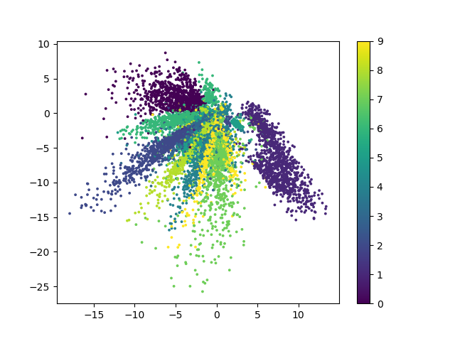
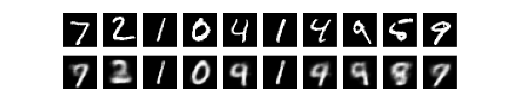

# cnn_autoencoder_mnist
This repository is for comparing CNN and DNN autoencoders.

# Usage

```shell
conda install pytorch==1.12.0 torchvision==0.13.0 torchaudio==0.12.0 cudatoolkit=10.2 -c pytorch
conda install matplotlib
```

```shell
    python train.py
    python plot_result.py
```

# 2-dim Manifold result
*DNN* | *CNN* | *DAE* 
:---: | :---: | :---: 
 |  |  

# re-generation result
*DNN* | *CNN* | *DAE* 
:---: | :---: | :---: 
 |  | 

# re-generation with noisy-input result 
*DNN* |                                    *CNN*                                     | *DAE* 
:---: |:----------------------------------------------------------------------------:| :---: 
 |  | 

